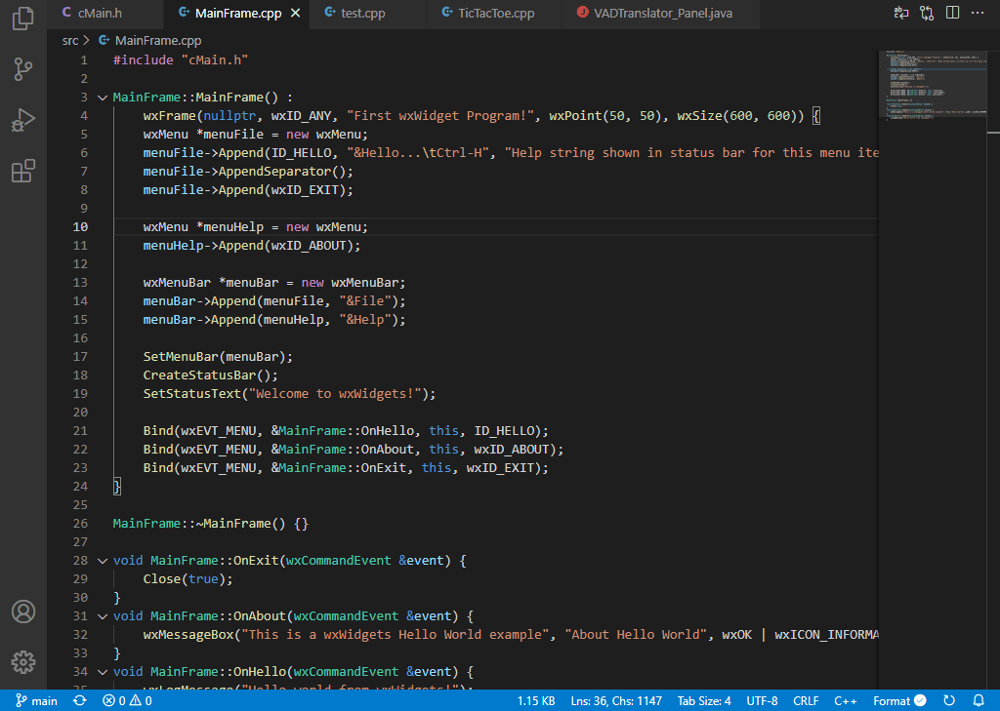
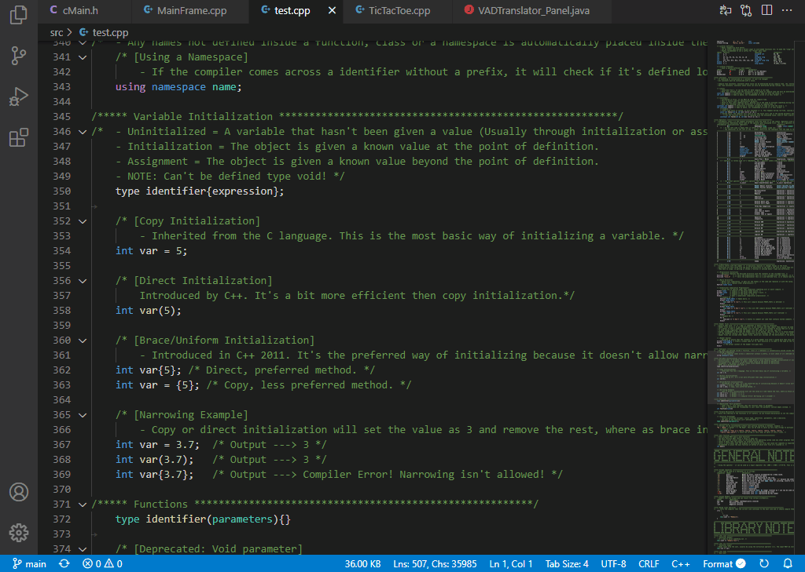
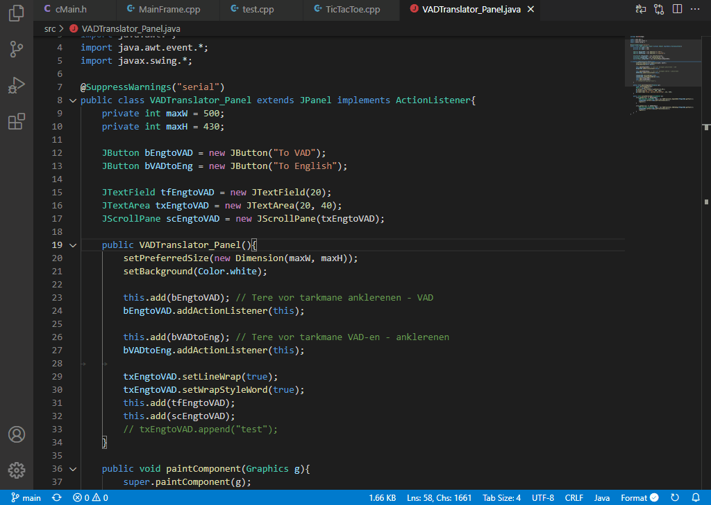
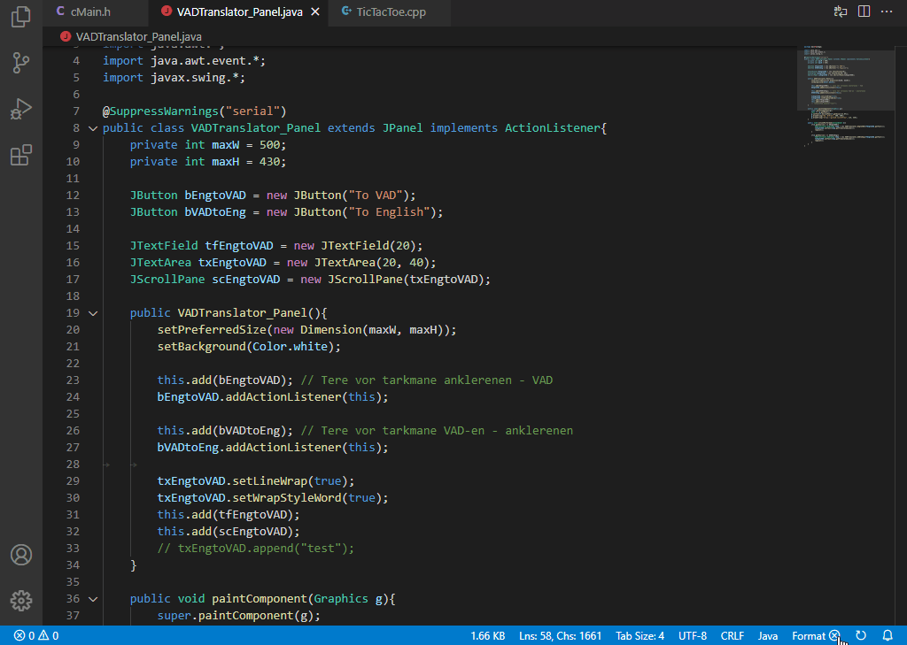
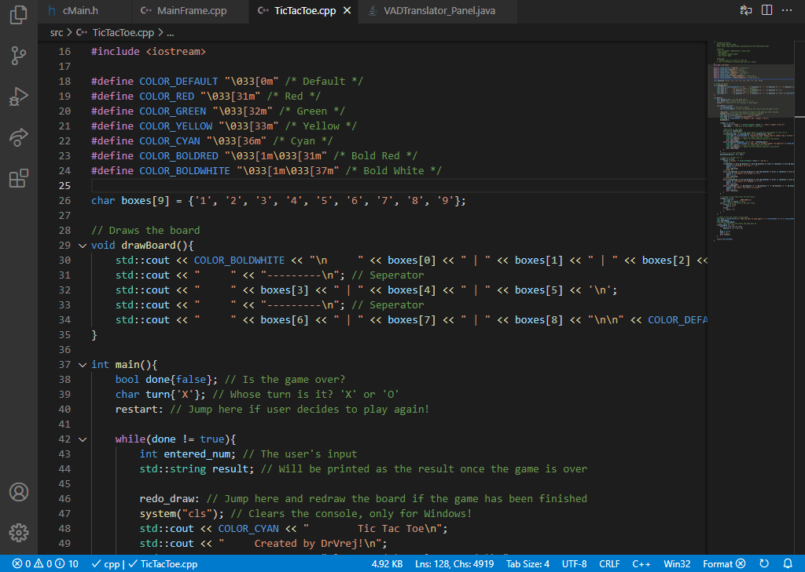
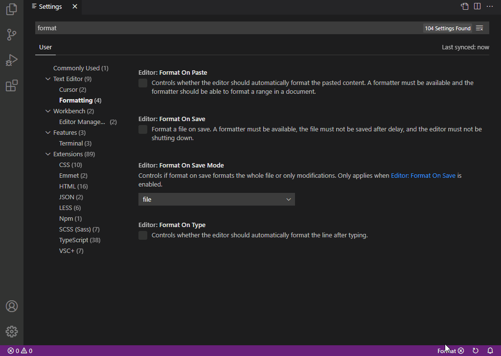
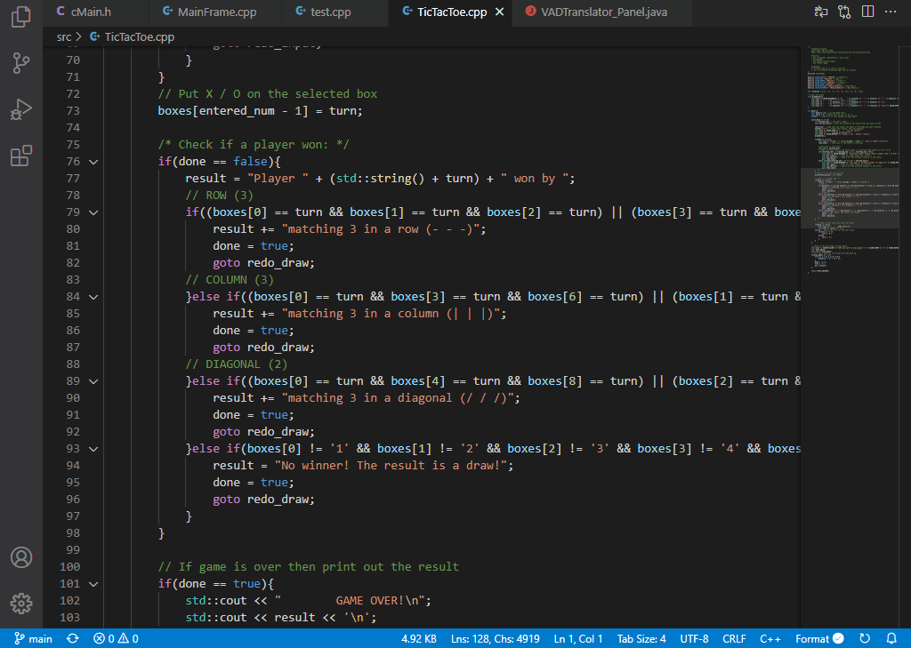

# 🛠️ Visual Studio Code+ (VSC+) ⚒️

Additional customizable tools for Visual Studio Code.

The goal of this extension is to add useful tools and additions to Visual Studio Code that are highly customizable. Features range from commands to status bar and tool bar items.

**[📝Changelog]()** | **[⚖️License]()**

------------------------------------------------------------------
## Table of Contents
- [📦Features](#📦-features)
- [⚙️Extension Settings](#⚙️-Extension-Settings)
- [📗Extension Commands](#📗-Extension-Commands)
- [📌Issues & Suggestions](#📌-Issues-&-Suggestions)
- [🙏Contributors](#🙏-Contributors)

------------------------------------------------------------------
## 📦 Features
> Note: For command features, check out the [📗Extension Commands](#📗-Extension-Commands) section!

__Reload Button__  
- Adds a small button in the status bar that reloads the current workbench / window. Useful when a refresh is needed for VSCode.
- Available everywhere.

__Text Information Display__  
- Adds a text in the status bar that displays the total number of lines and characters in the current file.
- When selecting, it displays the number of lines and characters selected (Next to the total numbers).
- Selection display supports both multiline and column selections!

  

__File Size Display__  
- Adds a text in the status bar that displays the size of the current file.
- Automatically changes between byte sizes depending on the total size.
- Supports bytes, kilobytes, megabytes, gigabytes.
- When clicked, a pop-up will appear showing the size in all byte sizes and allows the user to copy the path of the file.

__Formatting Toggle Button__  
- Adds a button to the status bar that toggles formatting.
- Displays visible check when active or X when not active.
- Supports the following toggles: `onPaste, onSave, onType`, can be customized.
- If one of the toggles is manually set by the user, an active check will appear.

  

__Word Wrap Toggle Button__  
- Adds a simple button in the tool bar that toggles word wrapping in the editor.

------------------------------------------------------------------
## ⚙️ Extension Settings

This extension contributes the following settings:
- `vscplus.statusBar.reloadButton.enabled`: Enable the reload workbench button in the status bar.
- `vscplus.statusBar.reloadButton.alignment`: Specifies the reload button's alignment on the status bar.
- `vscplus.statusBar.textInfo.enabled`: Enable the current file's text information in the status bar.
- `vscplus.statusBar.textInfo.alignment`: Specifies the text information alignment on the status bar.
- `vscplus.statusBar.textInfo.displaySelection`: Toggles whether or not it should display the number of selected lines and characters next to the total count in the status bar.
- `vscplus.statusBar.fileSize.enabled`: Enable the current file's size information in the status bar.
- `vscplus.statusBar.fileSize.alignment`: Specifies the current file's size information alignment on the status bar.
- `vscplus.statusBar.formatButton.enabled`: Enable the format toggle button on the status bar.
- `vscplus.statusBar.formatButton.alignment`: Specifies the format toggle button's alignment on the status bar.
- `vscplus.statusBar.formatButton.triggers`: Which formatting settings should the toggle change? Accepted items: `onPaste, onSave, onType`, anything else is ignored.
- `vscplus.toolBar.wordWrapButton.enabled`: Enable the word wrap toggle button in the tool bar.

------------------------------------------------------------------
## 📗 Extension Commands

This extension contributes the following commands:
- `vscplus.reload.workbench`: Reload current workbench
- `vscplus.display.fileinfo`: Display Current File's Information
- `vscplus.toggle.formatting`: Toggle File Formatting
- `vscplus.toggle.wordwrap`: Toggle Word Wrapping

------------------------------------------------------------------
## 📌 Issues & Suggestions

Found a bug or have a suggestion? Feel free to post an issue in the GitHub repository! [click here to go to GitHub issues](https://github.com/DrVrej/vscplus/issues)
> Note: Pull requests on GitHub are also welcome! Code optimizations, bug fixes, and additions are all appreciated!

------------------------------------------------------------------
## 🙏 Contributors
- [DrVrej](https://github.com/DrVrej) - Author of the extension.